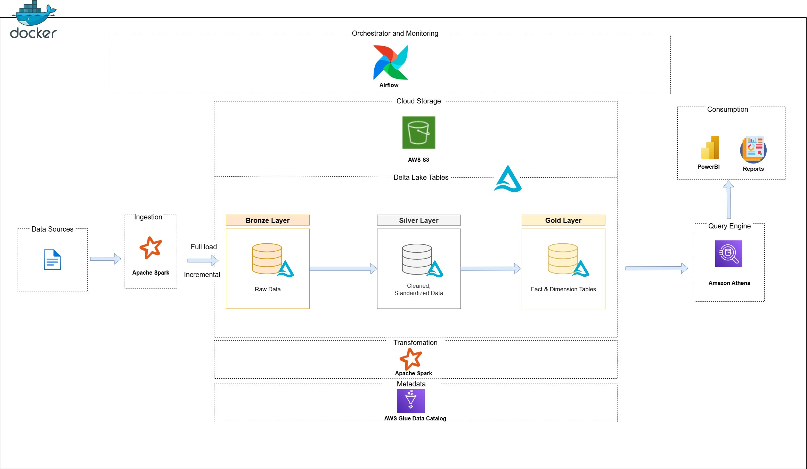

# Project Data Engineering (Nhóm 6)

**Tên đề tài:** "Xây dựng hệ thống Data Lakehouse phân tích dữ liệu bán hàng và hành vi khách hàng trên tập dữ liệu thương mại điện tử Olist"

**Mô tả tổng quan:** Ứng dụng kiến trúc Medallion 4 tầng (Bronze - Silver - Gold - Platinum) kết hợp với các công cụ như Apache Spark, Apache Airflow, Amazon S3, Delta Lake, AWS Athena và Power BI để xây dựng luồng xử lý dữ liệu (ETL Pipeline) tự động quy mô lớn.

## Hệ thống Data Lakehouse 4 Tầng (Medallion Architecture)
- **Bronze Layer (Ingestion):** Dữ liệu thô từ nguồn (Olist CSVs) được tải vào Data Lake (Amazon S3) dưới định dạng Delta Lake, hỗ trợ Full Load và Incremental Load.
- **Silver Layer (Cleaned):** Dữ liệu được làm sạch, xử lý null, loại bỏ trùng lặp và chuẩn hóa kiểu dữ liệu tạo thành "Single Source of Truth".
- **Gold Layer (Data Modeling):** Xây dựng mô hình Star Schema (Fact & Dimension), phân rã dữ liệu tối ưu hóa bằng Z-Ordering và Partitioning.
- **Platinum Layer (Data Marts & BI):** Dữ liệu được tổng hợp sẵn (Aggregated) theo các chiều phân tích báo cáo (như RFM, vận chuyển), phục vụ truy vấn cực nhanh cho AWS Athena và Dashboard Power BI.

## Kiến trúc hệ thống


## Cấu trúc thư mục
- `etl_pipeline/`: Chứa các Spark jobs xử lý dữ liệu tương ứng các tầng (bronze, silver, gold, platinum).
- `dags/`: Chứa các file Airflow DAGs. Hệ thống sử dụng **Master DAG** (`master_pipeline_dag.py`) để điều phối chạy tuần tự chuỗi ETL: Bronze → Silver → Gold → Platinum.
- `docker/`: Chứa Dockerfile và cấu hình cho các dịch vụ (Spark, Airflow).
- `dataset/`: Chứa bộ dữ liệu gốc của Olist (các tệp CSV).
- `config/`: Configuration files cho Spark, Airflow hoặc các dịch vụ khác.
- `notebooks/`: Chứa các Jupyter notebooks dùng để phát triển, thử nghiệm Spark jobs.
- `docker-compose.yml`: Triển khai hạ tầng container hóa.
- `.env`: Tệp cấu hình các biến môi trường cho hệ thống.
- `requirements.txt`: Danh sách các thư viện Python cần thiết.

## Bài toán Phân tích Dữ liệu (Analytical Objectives)

Dựa trên bộ dữ liệu **Olist E-commerce** (Brazil), hệ thống Data Lakehouse này sẽ tiến hành xử lý và xây dựng các mô hình dữ liệu (tầng Gold) để giải quyết các bài toán kinh doanh sau:

1. **Phân tích Doanh thu & Tăng trưởng:**
   - Theo dõi sự biến động của doanh thu và số lượng đơn đặt hàng theo thời gian (tháng, quý, năm).
   - Phân tích các yếu tố thúc đẩy doanh thu chính theo khu vực địa lý tại Brazil và theo danh mục sản phẩm.

2. **Hiệu suất Vận hành & Trải nghiệm Khách hàng:**
   - Đo lường hiệu suất chuỗi cung ứng: Phân tích tỷ lệ giao hàng đúng hạn (On-time Delivery), tỷ lệ trễ hạn, và thời gian vận chuyển trung bình từ người bán đến người mua.
   - Đánh giá mức độ hài lòng tổng thể: Đo lường xu hướng của điểm đánh giá (Review Scores) và tìm ra sự tương quan (correlation) giữa các đơn hàng bị trễ hạn với trải nghiệm mua sắm chung của khách hàng.

3. **Hiệu suất Sản phẩm & Người bán:**
   - Xác định danh sách các sản phẩm mang lại doanh thu cao nhất và thấp nhất.
   - Xếp hạng hiệu quả của Người bán dựa trên khối lượng đơn hàng và đánh giá từ khách hàng.

4. **Hành vi Khách hàng & Phân khúc RFM:**
   - Khám phá hành vi mua sắm và sự tập trung của khách hàng theo các tiểu bang/thành phố.
   - Áp dụng mô hình RFM (Recency, Frequency, Monetary) để nhận diện khách hàng VIP, khách hàng mới và khách hàng có nguy cơ rời bỏ.

## Cách chạy Project

### Yêu cầu hệ thống
- Đã cài đặt Docker và Docker Compose.
- Có tài khoản AWS (S3, Glue, Athena) và Access Keys để cấu hình lưu trữ Data Lake.

### 1. Cấu hình môi trường (Bắt buộc)
Trước khi chạy hệ thống, tạo file `.env` (copy từ `.env.example`) và thiết lập các biến môi trường kết nối AWS:
```bash
cp .env.example .env
```
Nội dung file `.env`:
```env
AWS_ACCESS_KEY_ID=your_access_key
AWS_SECRET_ACCESS_KEY=your_secret_key
AWS_REGION=us-east-1
S3_BUCKET_NAME=your-lakehouse-bucket
```

### 2. Build và Khởi động Dịch vụ
Chạy lệnh sau để build images và khởi chạy tất cả các dịch vụ dưới dạng nền (chạy ngầm). 
*(Lưu ý: Hệ thống đã tích hợp quy trình `airflow-init` để tự động tạo Connections cho AWS và Spark trong Airflow dựa trên file .env, do đó không cần cấu hình thủ công trên giao diện UI)*
```bash
docker compose up -d --build
```

### 2. Truy cập các Dịch vụ
Sau khi các container đã sẵn sàng, bạn có thể truy cập các dịch vụ sau qua trình duyệt:

- **Giao diện Apache Airflow**: [http://localhost:8081](http://localhost:8081)
  - **Tên đăng nhập**: `admin`
  - **Mật khẩu**: `admin`
- **Giao diện Spark Master**: [http://localhost:8080](http://localhost:8080)
- **Jupyter Notebook**: [http://localhost:8888](http://localhost:8888)
  - **Token**: `nhom6`
  - Sử dụng Jupyter để phân tích dữ liệu tương tác hoặc phát triển code.

### 3. Dừng các Dịch vụ
Để dừng các dịch vụ và gỡ bỏ các container:
```bash
docker compose down
```
Nếu bạn muốn xóa cả dữ liệu trong database (volumes):
```bash
docker compose down -v
```
